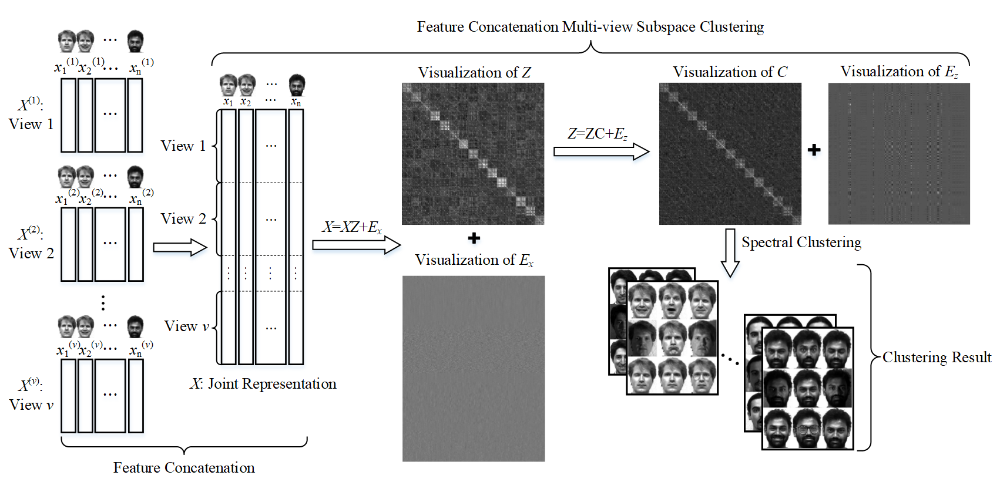

# FCMSC
Source codes of "Feature Concatenation Multi-view Subspace Clustering (FCMSC)" published in Neurocomputing 2020

If you find the codes useful in your research, please cite our work as follows. Thanks.

@article\{FCMSC, 
      &nbsp;&nbsp;&nbsp;&nbsp;title=\{Feature concatenation multi-view subspace clustering\}, 
      &nbsp;&nbsp;&nbsp;&nbsp;author=\{Zheng, Qinghai and Zhu, Jihua and Li, Zhongyu and Pang, Shanmin and Wang, Jun and Li, Yaochen\}, 
      &nbsp;&nbsp;&nbsp;&nbsp;journal=\{Neurocomputing\}, 
      &nbsp;&nbsp;&nbsp;&nbsp;volume=\{379C\}, 
      &nbsp;&nbsp;&nbsp;&nbsp;pages=\{89--102\}, 
      &nbsp;&nbsp;&nbsp;&nbsp;year=\{2020\}, 
      &nbsp;&nbsp;&nbsp;&nbsp;publisher=\{Elsevier\} 
\} 

Email: zhengqinghai@stu.xjtu.edu.cn
